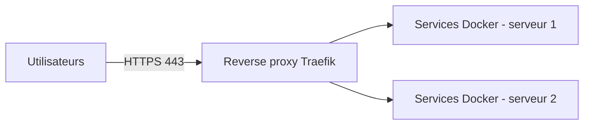

# eval-collab-Kais-Bouybouda-Nys

Dépôt de configuration et de documentation d'une petite infrastructure : une quinzaine de services en conteneurs Docker, répartis sur deux serveurs, publiés derrière un reverse proxy.

> Dépôt réalisé pour l'évaluation « Travail collaboratif & documentation technique » (option Infra).
> Les informations absentes du dépôt sont supposées et listées dans la section [Hypothèses](#hypothèses).

## Prérequis

| Outil | Version | Usage |
| --- | --- | --- |
| Git | 2.40 ou plus | Cloner le dépôt, créer les branches |
| Docker Engine | 27 (supposé) | Faire tourner les services |
| Docker Compose | v2, intégré à Docker (supposé) | Décrire et lancer les services |
| Accès SSH | compte de déploiement, pas `root` | Intervenir sur les deux serveurs |

## Installation

```bash
git clone https://github.com/KaisN7/eval-collab-Kais-Bouybouda-Nys.git
cd eval-collab-Kais-Bouybouda-Nys
```

Le dépôt est privé : il faut y avoir été invité (Settings → Collaborators).

## Usage

La branche `main` contient pour l'instant la documentation et les règles du dépôt.
Les fichiers de déploiement (`deploy/docker-compose.yml`, `deploy/deploy.sh`) sont proposés dans la PR `feature/deploy`, en cours de review et non mergée : ils ne doivent pas être utilisés en production en l'état.

Avant de proposer une modification, vérifier les fichiers touchés :

```bash
# Syntaxe d'un fichier Compose
docker compose -f <fichier-compose> config --quiet

# Syntaxe d'un script shell
bash -n <script.sh>
```

## Configuration

- Aucun secret dans le dépôt : mots de passe et jetons passent par un fichier `.env` local, ignoré par Git.
- Les versions des images sont fixées sur une version précise, jamais `latest`.
- Seuls les ports 80 et 443 du reverse proxy sont publiés sur les serveurs. Les autres services restent sur le réseau interne Docker.

## Architecture



- Une quinzaine de services, de nouveaux services ajoutés chaque mois.
- Le choix du reverse proxy est décrit dans [ADR-0001](docs/adr/0001-choix-du-reverse-proxy.md).
- Toutes les décisions d'architecture sont dans [`docs/adr/`](docs/adr/), à partir du [modèle](docs/adr/0000-modele.md).

## Contribution

1. Ouvrir une issue (bug ou évolution) avec un label de type et de priorité.
2. Créer une branche depuis `main` : `<type>/<n° issue>-<description>`, par exemple `docs/2-documentation`.
3. Committer au format Conventional Commits : `type(scope): description`.
4. Ouvrir une PR vers `main` avec `Closes #<n°>`. Aucun commit direct sur `main` (branche protégée par un ruleset).
5. Review avec des commentaires au format Conventional Comments, puis **Squash and merge**.

Les consignes pour les assistants et agents IA sont dans [AGENTS.md](AGENTS.md).

## Licence et contacts

- Licence : aucune licence définie, dépôt privé à usage pédagogique (supposé).
- Mainteneur : [@KaisN7](https://github.com/KaisN7), propriétaire de tout le dépôt (voir `.github/CODEOWNERS`).
- Une question ou un problème : ouvrir une issue.

## Hypothèses

Ces informations ne figurent pas dans les fichiers du dépôt et ont été supposées :

- les versions de Docker et de Docker Compose ;
- le nombre de services (une quinzaine) et de serveurs (deux), repris du sujet de l'ADR ;
- l'absence de licence et l'usage pédagogique du dépôt.
